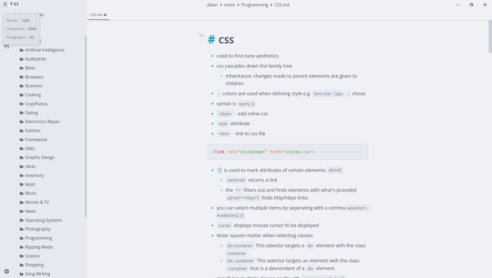

<h3 align="center">
    
   
    
    Catppuccin for <a href="https://github.com/marktext/marktext">MarkText</a>
    

</h3>

    
    
    

Catppuccin theme for the simple and elegant markdown editor MarkText (work in progress)

## Previews

🌻 Latte

🪴 Frappé

🌺 Macchiato

🌿 Mocha

## Access

- download one the `.css` files entitled `catppuccin-***-theme.css`, or simply copy the code from one of the files.

## Usage

1. before using, make sure your version  of MarkText has the [Custom CSS Support](https://github.com/marktext/marktext/pull/3279) pull request merged. You can easily do this by installing [jacobwhall's](https://github.com/jacobwhall) fork of [MarkText](https://github.com/jacobwhall/marktext)

2. Then, navigate to `Preferences` > `Theme` and paste the theme into the `Custom` CSS text box

